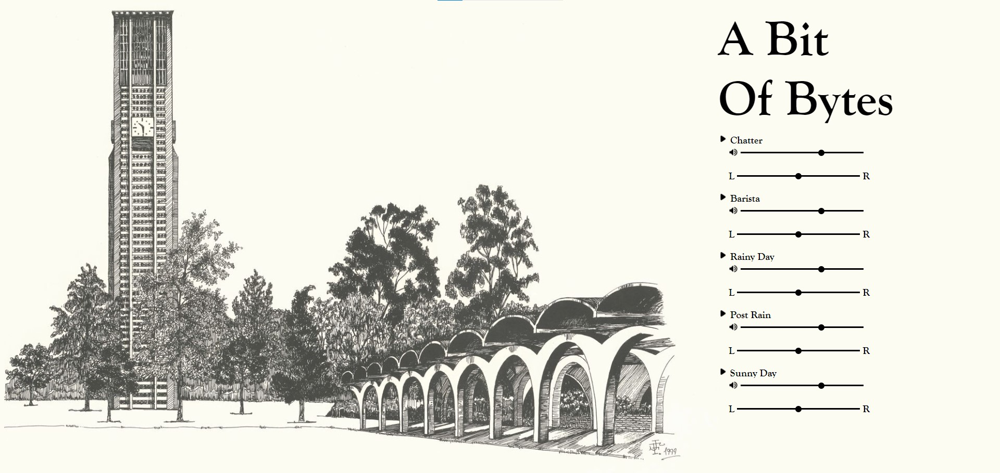

# ABitOfBytes

A Bit Of Bytes is an homage to a cafe at my alma mater (University of California, Riverside) called Bytes, where my friends and I often visited to study and pass time between classes. I drew inspiration for A Bit Of Bytes from [I Miss My Cafe](https://imissmycafe.com), which recreates sounds one might hear at a coffeeshop for a burst of nostalgia during the COVID-19 quarantine.

The site is hosted [here](https://abitofbytes.herokuapp.com/) using Heroku!

## Overview

A Bit Of Bytes is a single-page web application that provides users with select audio samples (which were hand-picked and edited) meant to mock the background noises of a coffee shop to aid listeners' relaxation or productivity by providing a collection of 'white noise' alternatives over upbeat or lyrical songs that can often be distracting.

A Bit Of Bytes is built with NodeJS/Express for route-handling on the backend, and vanilla Javascript with HTML/CSS for the frontend.

## How I Built It

### Audio Samples

The audio used on [I Miss My Cafe](https://imissmycafe.com) did really well at replicating coffee shop sounds, but I kept getting distracted by the audio's looping every few minutes since the transitions weren't seamless. While [I Miss My Cafe](https://imissmycafe.com) was successful at conveying a brief sense of nostalgia to listeners, I wanted A Bit Of Bytes to be better-suited for longer stretches of productivity, so I set out to create custom audio files with nearly seamless looping to minimize distractions.

All the audio files used in A Bit Of Bytes were downloaded from [Sound Jay](http://soundjay.com) and edited using [Kapwing](http://kapwing.com) to synchronize volumes across all five audio files used, and to layer and crop each audio file to create seamless looping. The 'Barista' audio used on A Bit Of Bytes is also a custom audio I made by splicing numerous smaller audio samples together since I couldn't find one I was happy with online.

### Volume and Stereo Sound Sliders

The volume and stereo sliders accompanying each audio file were created using the GainNode and StereoPannerNode interfaces provided by the [Web Audio API](https://developer.mozilla.org/en-US/docs/Web/API/Web_Audio_API). The GainNode interface has a gain property that adjusts the volume of an audio context with 0 being muted, 1 being the default volume, and anything beyond 1 being scaled logarithmically (decibel scaling). The StereoPannerNode adjusts the volume level on each output channel (left and right stereo audio channels) to mimic a change in the audio's directionality with -1 being full left audio, 0 being equally balanced, and 1 being full right audio.

## Future Development

In the future, I plan to implement features like a small Kanban board or integrate Google Calendar to reinforce the productivity aspect of the site. This project was created with my friends in mind since we share a similar appreciation for the Bytes cafe, but I want to polish up the site's aesthetic, add a few UCR-themed easter eggs, and purchase a domain to host the site on in hopes of sharing it with other UCR students and alumni.
